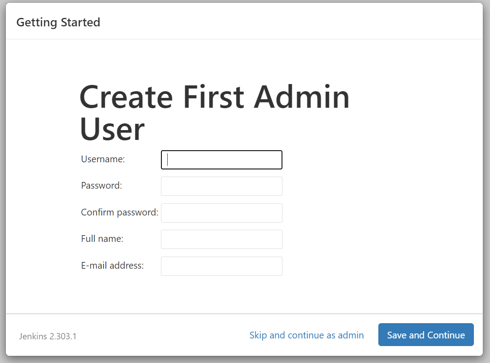
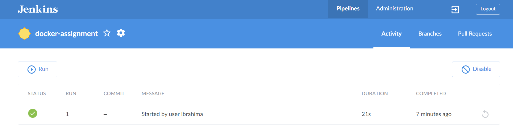

## Docker-assignment Kura Labs

See the [PDF](https://github.com/ibrahima1289/docker-assignment/blob/main/Docker%20assignment.pdf) document for the requirements of this assignment.

We are using **Windows**.

### TASK 1

1. Automate the process to create a docker image by using a Dockerfile (installing git and ssh).

Create a Dockerfile to install ubuntu in the container

```
FROM ubuntu:latest
LABEL description="GIT"
RUN apt update -y
RUN apt install git -y
RUN apt-get update && DEBIAN_FRONTEND="noninteractive" TZ="America/New_York" apt-get install -y tzdata
RUN apt install ssh -y
```
2. Run the Dockerfile to build the image
```
docker build -t git-image .
```

3. Create a container from the GIT image with a shared folder attached.
```
docker run -ti -v C:{PATH}/shared git bash
```

4. Create a new SSH key in order to be able to share files from local machine to github.

   Follow the steps below: **one command at a time**.
```
ssh-keygen

ssh-add sshkey

cat public_key ---> paste key value in github to ssh

eval "$(ssh-agent -s)"

chmod 400 private_key

ssh -T git@github.com ---> connect to github
```

5. Now, clone the github repo to you local machine
```
clone git@github.com:ibrahima1289/docker-assignment.git 
```

6. Create the file by doing the following: **one command at a time**.

```
cd docker-assignment

touch git_file.txt
```

7. Finally, push the repo to github: **one command at a time**.
```
git add .

git commit -m "adding .txt file to repo"

git config --global user.email "email@email.com"
git config --global user.name "github_username"

git pull

git push origin main
```

### TASK 2

1. Open the command line and run the command below to create the docker network.
```
docker network create jenkins
```

2. In the Docker folder, create a folder locally called task2, here is the path for this case C:\Users\Admin\Docker\task2

3. cd inton the `task2` folder.

4. Run these commands below:
```
docker run --name jenkins-docker --rm --detach ^
  --privileged --network jenkins --network-alias docker ^
  --env DOCKER_TLS_CERTDIR=/certs ^
  --volume jenkins-docker-certs:/certs/client ^
  --volume jenkins-data:/var/jenkins_home ^
  docker:dind
```

You can see how it looks like :


5. Create a Dockerfile in the task2 folder. Then, copy/paste the code below.
```
FROM jenkins/jenkins:2.303.1-jdk11
USER root
RUN apt-get update && apt-get install -y apt-transport-https \
       ca-certificates curl gnupg2 \
       software-properties-common
RUN curl -fsSL https://download.docker.com/linux/debian/gpg | apt-key add -
RUN apt-key fingerprint 0EBFCD88
RUN add-apt-repository \
       "deb [arch=amd64] https://download.docker.com/linux/debian \
       $(lsb_release -cs) stable"
RUN apt-get update && apt-get install -y docker-ce-cli
USER jenkins
RUN jenkins-plugin-cli --plugins "blueocean:1.24.7 docker-workflow:1.26"
```

6. Run the build command
```
docker build -t myjenkins-blueocean:1.1 .
```


7. If the build is successful, run:
```
Run the following commands in CMD Command Prompt
docker run --name jenkins-blueocean --rm --detach ^
  --network jenkins --env DOCKER_HOST=tcp://docker:2376 ^
  --env DOCKER_CERT_PATH=/certs/client --env DOCKER_TLS_VERIFY=1 ^
  --volume jenkins-data:/var/jenkins_home ^
  --volume jenkins-docker-certs:/certs/client:ro ^
  --publish 8080:8080 --publish 50000:50000 myjenkins-blueocean:1.1
```


8. Now, we have to log into Jenkins

9. Open a browser and go to http://localhost:8080 

In case you se the picture below, click on `Allowaccess`.


10. You will see this page


11. For the password do the following:
```
docker exec -it jenkins-blueocean bash
```

12. To see the password, do this:
```
cat /var/jenkins_home/secrets/initialAdminPassword
```

13. Copy the password and paste it into your localhost browser, then follow the instructions to create the Jenkins account.


Click on `Install suggested plugins`. Once finished, you will see:



Create the account and login.

Choose the localhost:8080 for the `Instance Configuration`.


14. Download the required plugins:


15. Create a new job, choose `pipeline`


16. You can use `a.` or `b.`.

	a. Create a Jenkinsfile in the repo created in github.
	
	You can use this [doc](https://github.com/ibrahima1289/DEPLOY01_HELLO_WORLD/blob/main/Deployment%231.pdf) to setup ssh If you chose to use a `freestype project`.
	
	b. Write a pipeline script, you can copy and paste the script below.
	
	```
	pipeline {
	agent {
    	docker { image 'ubuntu:latest' }
	}
	stages {
    	stage('Build'){
        	steps{
            	echo 'Building stage ...'
        	}
    	}
    	stage('Test') {
        	steps {
            	echo 'Testing stage ...'
        	}
    	}
    	stage('Deploy') {
        	steps{
            	echo 'Deploying stage ...'
        	}
    	      }
	   }
	}
	```

Her is how it looks like.


Here is the result after the buid:


	
### TASK 3

Create a stage from a previous pipeline in your Jenkins container, then build the job through BlueOcean.

For this task, we will use the same pipeline and build it through BlueOcean

1. In the Jenkins dashboard, select BlueOcean - you will see:



2. Add the script highlighted in red in the picture below to the `pipeline script`.


3. Run a new build - if successful, you will see:


4. We can see both build successful in Jenkins BlueOcean.


